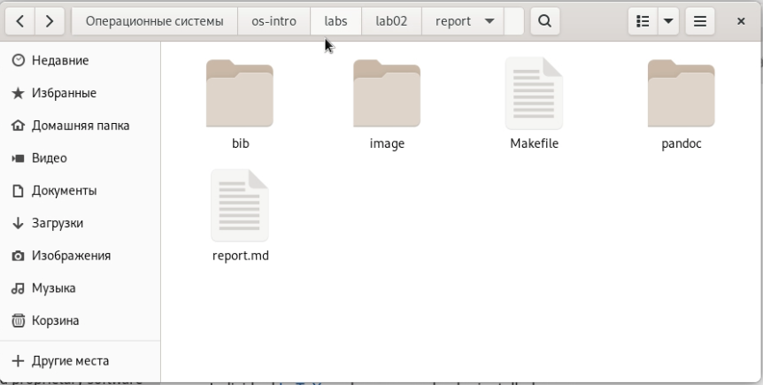
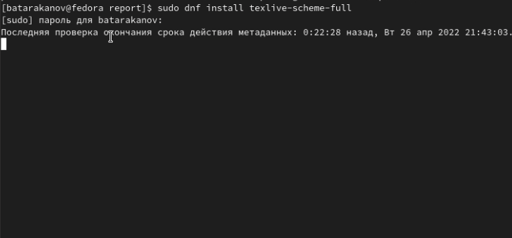
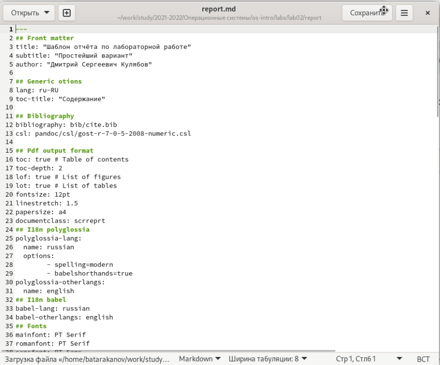
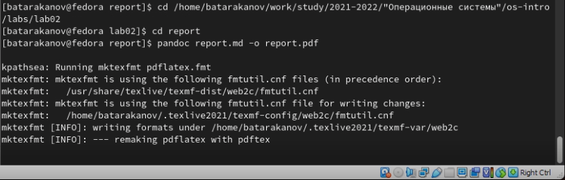
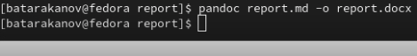
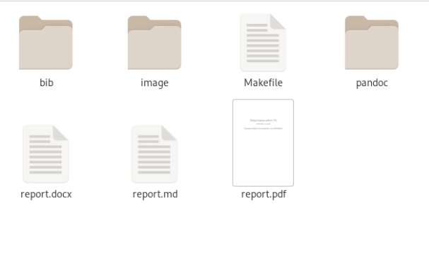

---
## Front matter
title: "Лабораторная работа №3"
subtitle: "Управление версиями"
author: "Тараканов Борис Александрович студ 1032212284"

## Generic otions
lang: ru-RU
toc-title: "Содержание"

## Bibliography
bibliography: bib/cite.bib
csl: pandoc/csl/gost-r-7-0-5-2008-numeric.csl

## Pdf output format
toc: true # Table of contents
toc-depth: 2
lof: true # List of figures
lot: true # List of tables
fontsize: 12pt
linestretch: 1.5
papersize: a4
documentclass: scrreprt
## I18n polyglossia
polyglossia-lang:
  name: russian
  options:
	- spelling=modern
	- babelshorthands=true
polyglossia-otherlangs:
  name: english
## I18n babel
babel-lang: russian
babel-otherlangs: english
## Fonts
mainfont: PT Serif
romanfont: PT Serif
sansfont: PT Sans
monofont: PT Mono
mainfontoptions: Ligatures=TeX
romanfontoptions: Ligatures=TeX
sansfontoptions: Ligatures=TeX,Scale=MatchLowercase
monofontoptions: Scale=MatchLowercase,Scale=0.9
## Biblatex
biblatex: true
biblio-style: "gost-numeric"
biblatexoptions:
  - parentracker=true
  - backend=biber
  - hyperref=auto
  - language=auto
  - autolang=other*
  - citestyle=gost-numeric
## Pandoc-crossref LaTeX customization
figureTitle: "Рис."
tableTitle: "Таблица"
listingTitle: "Листинг"
lofTitle: "Список иллюстраций"
lotTitle: "Список таблиц"
lolTitle: "Листинги"
## Misc options
indent: true
header-includes:
  - \usepackage{indentfirst}
  - \usepackage{float} # keep figures where there are in the text
  - \floatplacement{figure}{H} # keep figures where there are in the text
---

#Цель работы

– Научиться оформлять отчёты с помощью легковесного языка разметки Markdown.

#Задание

– Сделайте отчёт по предыдущей лабораторной работе в формате Markdown.
– Вкачествеотчётапросьбапредоставитьотчётыв3форматах:pdf,docx иmd (вархиве,
поскольку он должен содержать скриншоты,Makefile ит.д.)
w
#Теоретическое введение

Markdown — облегчённый язык разметки, созданный с целью обозначения форматирования в простом тексте, с максимальным сохранением его читаемости человеком, и пригодный для машинного преобразования в языки для продвинутых публикаций.

#Выполнение лабораторной работы

#Открытие файла и уствановка ПО
Откроем папку Lab02 (рис. 1). Установим пакет Latex для работы программы Pandoc (рис. 2)

{ #fig:001 width=70% }

{ #fig:001 width=70% }

#Написание отчета (рис. 3):
Используя текстовый редактор, откроем файл report.md (содержит шаблон отчета). Далее используя указания к лабораторной работе, создадим отчет для лабораторной работы №2.

{ #fig:001 width=70% }

#Конвертация:
Используя командную строку и программу Pandoc конвертируем файл report.md в файлы report.pdf (рис. 4) и report.docx (рис. 

{ #fig:001 width=70% }

{ #fig:001 width=70% }

#Проверка результата:
Откроем папку с файлами и удостоверимся, что файлы созданны (рис. 6).

{ #fig:001 width=70% }

#Выводы 
В ходе выполнения лабораторной работы я познакомился с языком разметки markdown и способом конвертации MD файлов в различные форматыю
