---
# Front matter
lang: ru-RU
title: "Лабораторная работа 4"
subtitle: "Основы интерфейса взаимодействия пользователя с системой Unix на уровне командной строки"
author: "Тараканов Борис Александрович студент НПИбд-02-21"

# Formatting
toc-title: "Содержание"
toc: true # Table of contents
toc_depth: 2
fontsize: 12pt
linestretch: 1.5
papersize: a4paper
documentclass: scrreprt
polyglossia-lang: russian
polyglossia-otherlangs: english
mainfont: PT Serif
romanfont: PT Serif
sansfont: PT Sans
monofont: PT Mono
mainfontoptions: Ligatures=TeX
romanfontoptions: Ligatures=TeX
sansfontoptions: Ligatures=TeX,Scale=MatchLowercase
monofontoptions: Scale=MatchLowercase
indent: true
pdf-engine: lualatex
header-includes:
  - \linepenalty=10 # the penalty added to the badness of each line within a paragraph (no associated penalty node) Increasing the value makes tex try to have fewer lines in the paragraph.
  - \interlinepenalty=0 # value of the penalty (node) added after each line of a paragraph.
  - \hyphenpenalty=50 # the penalty for line breaking at an automatically inserted hyphen
  - \exhyphenpenalty=50 # the penalty for line breaking at an explicit hyphen
  - \binoppenalty=700 # the penalty for breaking a line at a binary operator
  - \relpenalty=500 # the penalty for breaking a line at a relation
  - \clubpenalty=150 # extra penalty for breaking after first line of a paragraph
  - \widowpenalty=150 # extra penalty for breaking before last line of a paragraph
  - \displaywidowpenalty=50 # extra penalty for breaking before last line before a display math
  - \brokenpenalty=100 # extra penalty for page breaking after a hyphenated line
  - \predisplaypenalty=10000 # penalty for breaking before a display
  - \postdisplaypenalty=0 # penalty for breaking after a display
  - \floatingpenalty = 20000 # penalty for splitting an insertion (can only be split footnote in standard LaTeX)
  - \raggedbottom # or \flushbottom
  - \usepackage{float} # keep figures where there are in the text
  - \floatplacement{figure}{H} # keep figures where there are in the text
---

# Цель работы

Приобретение практических навыков взаимодействия пользователя с системой по-
средством командной строки.

#Теоритическое введение:

В операционной системетипа Linux взаимодействие пользователя с системой обычно
осуществляется с помощью командной строки посредством построчного ввода ко-
манд.При этом обычно используется командные интерпретаторы языка shell: /bin/sh;
/bin/csh; /bin/ksh.

# Задание 

1. Определите полное имя вашего домашнего каталога.Далее относительно этого ката-
лога будут выполняться последующие упражнения
2. Выполните некоторые действия с каталогами
3. Выполните некоторые действия с каталогами
4. С помощью команды man определите, какую опцию команды ls нужно использо-
ватьдля просмотра содержимое нетолько указанного каталога,но и подкаталогов,
входящих в него
5. Спомощьюкомандыman определитенаборопцийкомандыls,позволяющийотсорти-
ровать по времени последнего изменения выводимый список содержимого каталога
с развёрнутым описанием файлов.
6. Используйте команду man для просмотра описания следующих команд: cd,pwd,mkdir,
rmdir,rm.Поясните основные опции этих команд.
7. Используя информацию,полученную при помощи команды history,выполните мо-
дификацию и исполнение нескольких команд из буфера команд.

# Выполнение лабораторной работы

1. Определим путь домашнего каталога (рис. 1)

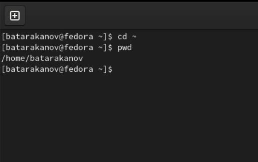{ #fig:001 width=70% }

2. Перейдем в каталог tmp, просмотрим его содержимое с помощью команд ls (просмотр файлов), ls -l (просмотр файлов и владельцев) (рис. 2), ls -a (просмотр скрытых файлов) (рис. 3)

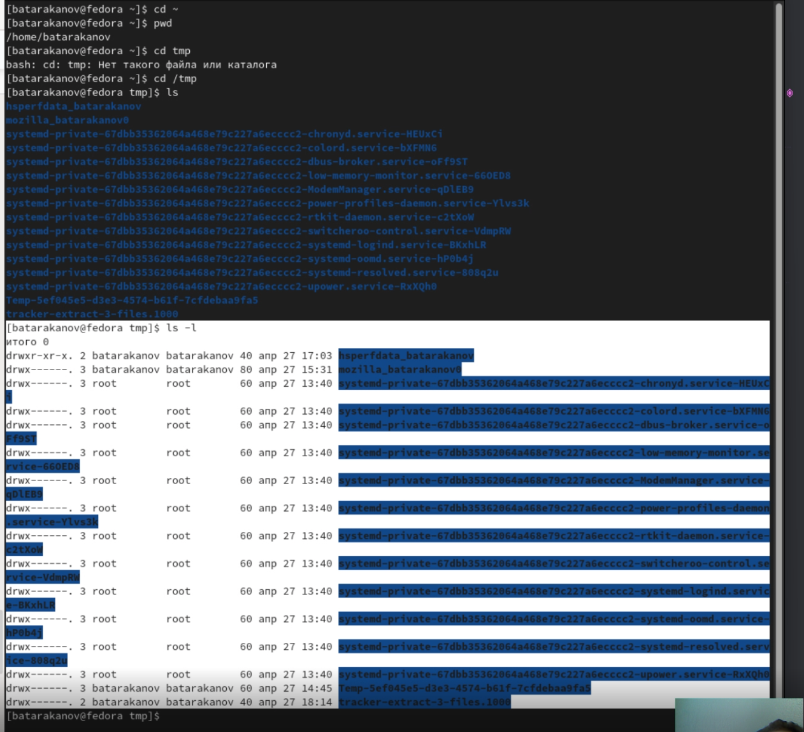{ #fig:001 width=70% }

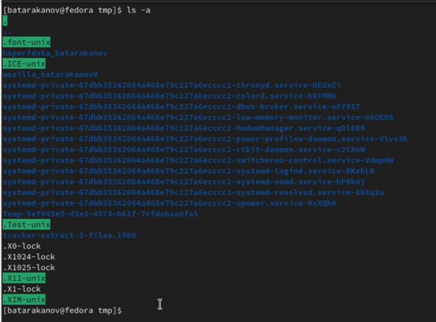{ #fig:001 width=70% }

Перейдем в каталог /var/spool для поиска подкаталога cron (рис. 4)
Перейдем в домашний каталог и посмотрим на владельцев (команда ls -l), очевидно владелец - мой пользователь (рис. 5)

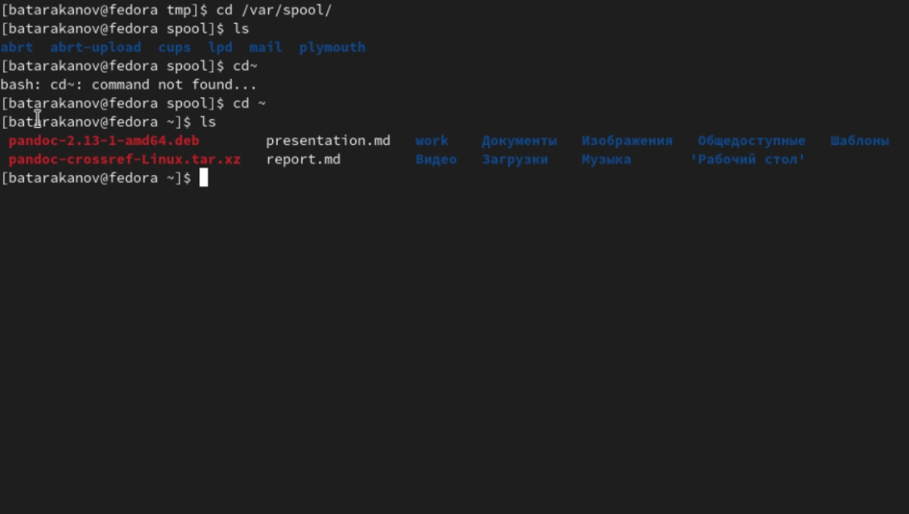{ #fig:001 width=70% }

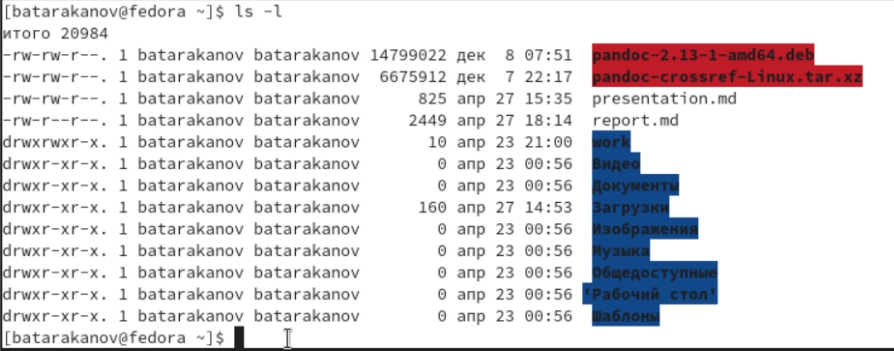{ #fig:001 width=70% }

3. Создадим каталог newdir и newdir/morefun. В домашней папке создадим сразу три каталога одной командой (mkdir) и удалим их одной командой (rmdir). Совершим неудачную попытку удалить каталог newdir командой rm, тк не был указан аргумент -r. Удалим каталог morefun, проверка этой операции (newdir - пустой). (рис. 6)

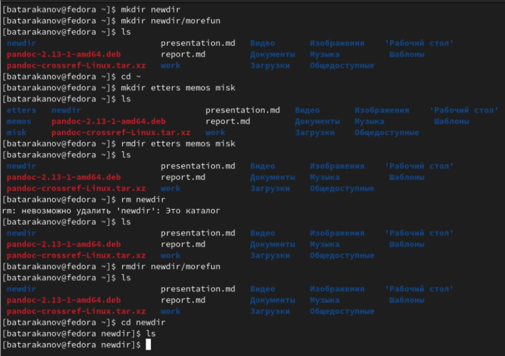{ #fig:001 width=70% }

4. Используя команду man ls что для просмотра содержимого не только каталога, но и подкаталогов, нужно использовать опцию -R (рис. 7)

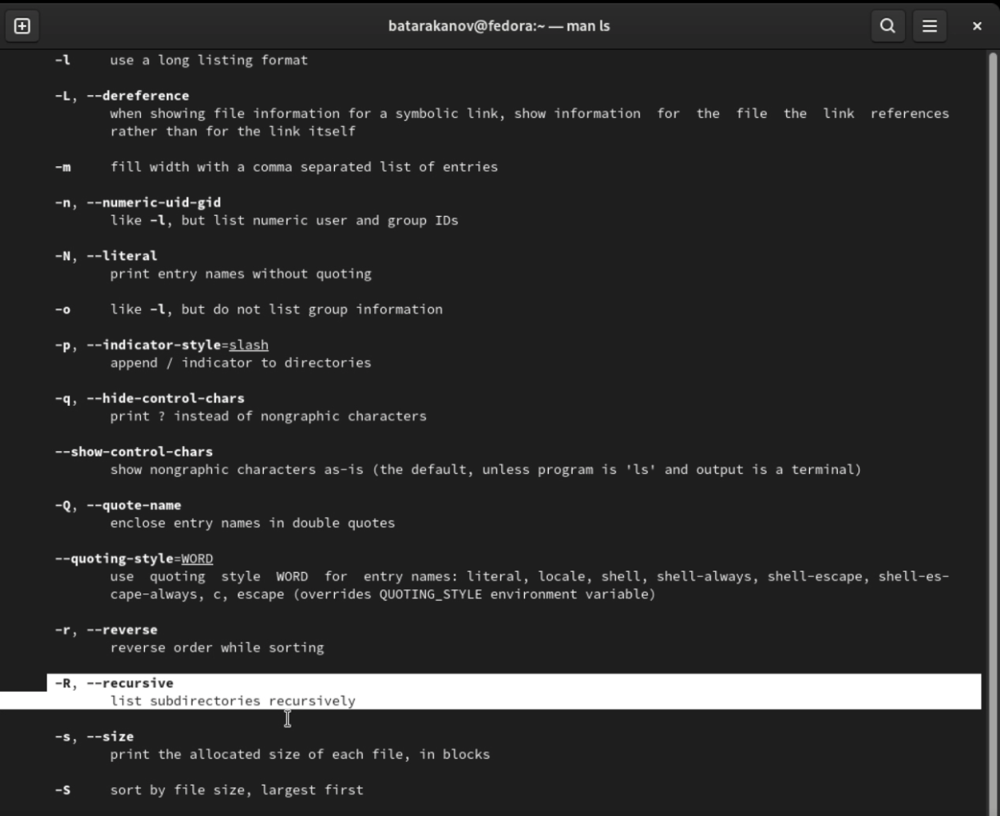{ #fig:001 width=70% }

5. Используя команду man ls что для просмотра содержимого с сортировкой по времени нужно использовать опцию -t (рис. 8)

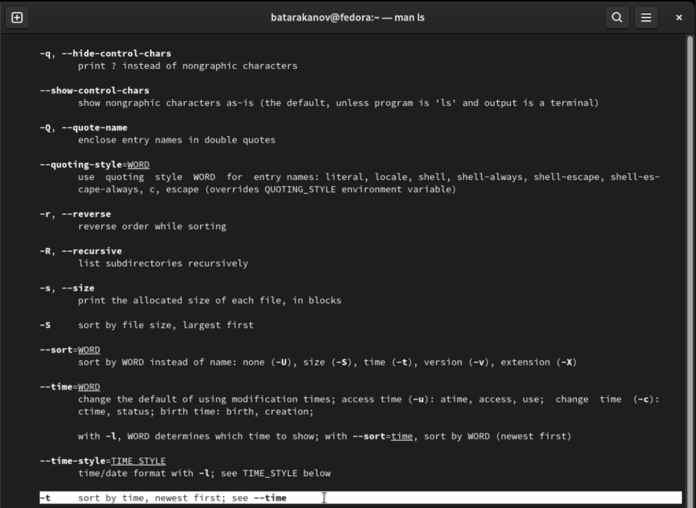{ #fig:001 width=70% }

6. Получим информацию о командах cd,pwd,mkdir,rmdir,rm с помощью команды man (рис. 9).
Получаем следующую информацию:
- cd - используется для перемещения по файловой системе операционной системытипа Linux.
- pwd - используется для определения абсолютного пути ктекущему каталогу.
- mkdir - используется для создания каталогов.
- rmdir - используется для удаления каталогов.
- rm - используется для удаления файлов и/или каталогов.

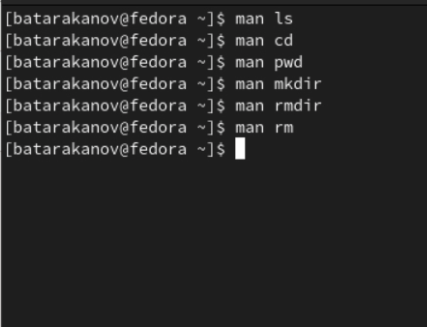{ #fig:001 width=70% }

7. Используя информацию,полученную при помощи команды history (рис. 10),выполним команду номер 157 и измененную команду 130 (рис.11) 

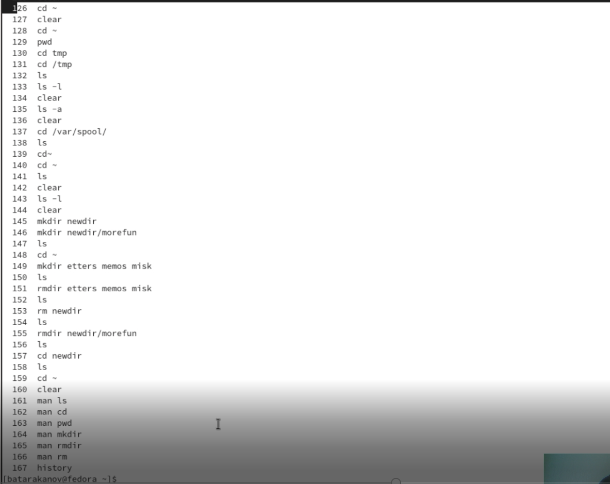{ #fig:001 width=70% }

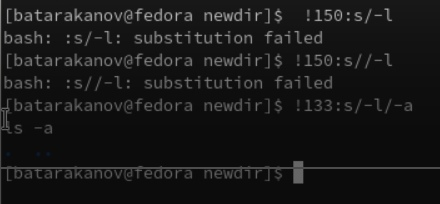{ #fig:001 width=70% }

# Вывод

В ходе лабораторной работы я приобрел практические навыки взаимодействия пользователя с системой по-
средством командной строки.

# Контрольные вопросы

1. Программа, позволяющая управлять комьпьютером с помощью текстовых команд.
2. Команда pwd (для примера см. задание 1 (рис. 1))
3. Командой ls можно определить имена и тип файлов (для примера см. задание 2 (рис. 2)). 
4. Командой ls -a можно посмотреть скрытые файлы (для примера см. задание 2 (рис. 3))
5. Команда rm - для файла, rmdir - для пустого каталога, командой rm можно удалять и каталоги, выбрав соответствующую опцию (для примера см. задание 3)
6. При помощи команды history
7. Используя команду !номер:s// (для примера см. задание  7 (рис. 11))
8. ЗАписать несколько команд в одну строчку можно ререз точку с запятой, например cd ~ ;ls
9. Символ - указывающий интерпретацию, что последующий сивол / символы нужно воспринимать как простой текст
10. Список файлов в текущем каталоге + информация о файлах (владелец, дата, размер и тд.)
11. Относительный путь - путь относительно текущей папки (например файл test.txt c абсолютным путем ~/work/os-intro/labs/lab01/test.txt будет иметь относительный путь labs/lab01/test.txt для текущей папки os-intro)
12. Написав команду man, а затем название команды
13. Клавиша Tab
