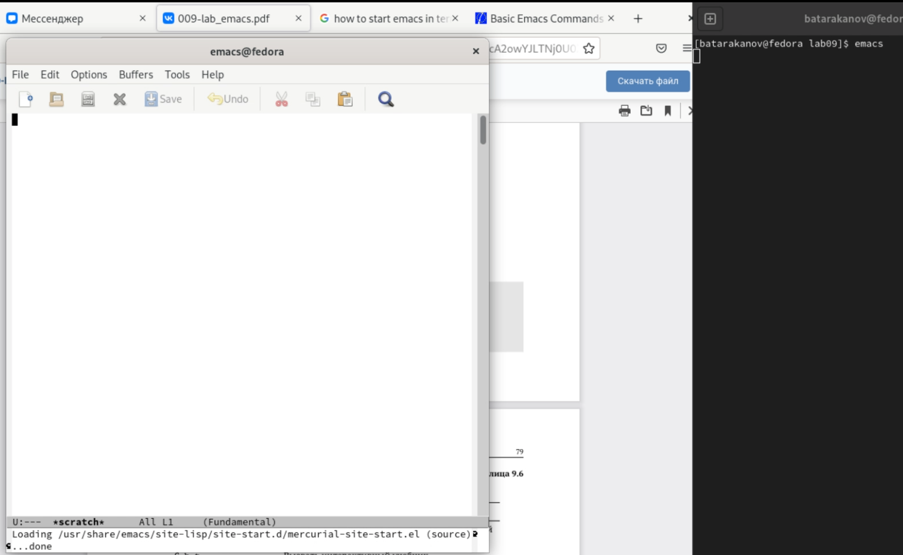
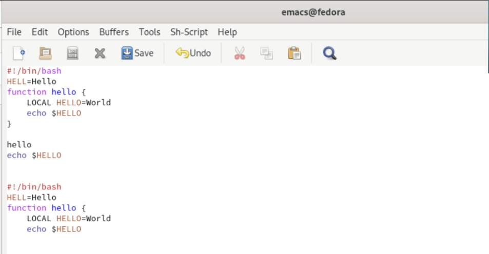
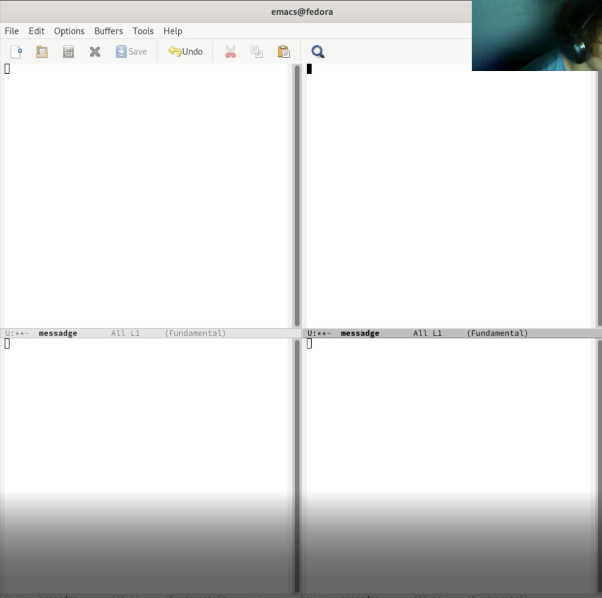
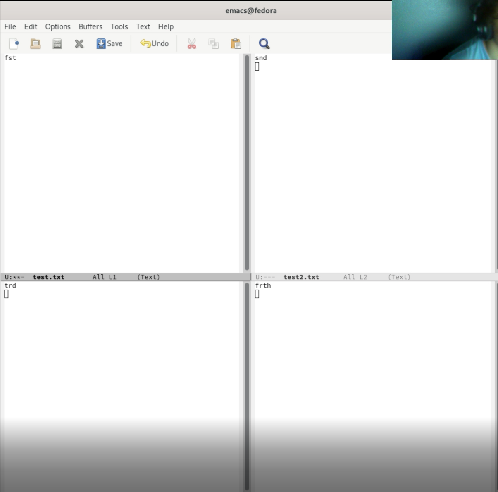

---
## Front matter
title: "Лаб. 9"
subtitle: "Emacs"
author: "Тараканов Борис, студент НПИ"

## Generic otions
lang: ru-RU
toc-title: "Содержание"

## Bibliography
bibliography: bib/cite.bib
csl: pandoc/csl/gost-r-7-0-5-2008-numeric.csl

## Pdf output format
toc: true # Table of contents
toc-depth: 2
lof: true # List of figures
lot: true # List of tables
fontsize: 12pt
linestretch: 1.5
papersize: a4
documentclass: scrreprt
## I18n polyglossia
polyglossia-lang:
  name: russian
  options:
	- spelling=modern
	- babelshorthands=true
polyglossia-otherlangs:
  name: english
## I18n babel
babel-lang: russian
babel-otherlangs: english
## Fonts
mainfont: PT Serif
romanfont: PT Serif
sansfont: PT Sans
monofont: PT Mono
mainfontoptions: Ligatures=TeX
romanfontoptions: Ligatures=TeX
sansfontoptions: Ligatures=TeX,Scale=MatchLowercase
monofontoptions: Scale=MatchLowercase,Scale=0.9
## Biblatex
biblatex: true
biblio-style: "gost-numeric"
biblatexoptions:
  - parentracker=true
  - backend=biber
  - hyperref=auto
  - language=auto
  - autolang=other*
  - citestyle=gost-numeric
## Pandoc-crossref LaTeX customization
figureTitle: "Рис."
lofTitle: "Список иллюстраций"
## Misc options
indent: true
header-includes:
  - \usepackage{indentfirst}
  - \usepackage{float} # keep figures where there are in the text
  - \floatplacement{figure}{H} # keep figures where there are in the text
---

# Цель работы

Познакомиться с операционной системой Linux.Получить практические навыки рабо-
ты с редактором Emacs

# Задание

- Открыть emacs.
- Создать файл lab07.sh Наберfnm текст.
- Выполнить команды
- Разделить экран

# Теоретическое введение

Emacs — семейство многофункциональных расширяемых текстовых редакторов. Оригинальный EMACS был написан в 1976 году Ричардом Столлманом и Гаем Стилом как набор макросов для редактирования для редактора TECO.

# Выполнение лабораторной работы

Запустим сервер Emacs (рис. 1)

{ #fig:001 width=70% }

Введем текст программы и выполним с ним действия, предписанные заданием (рис.2)

{ #fig:001 width=70% }

Разделим экран на 4 части командами C-x 3 и C-x 2 (рис. 3)

{ #fig:001 width=70% }

Заполним каждое из окон текстом и выполним просттые манипуляции (рис. 4)

{ #fig:001 width=70% }

# Выводы

В ходе этапа я познакомиться с операционной системой Linux и получил практические навыки рабо-
ты с редактором Emacs.

