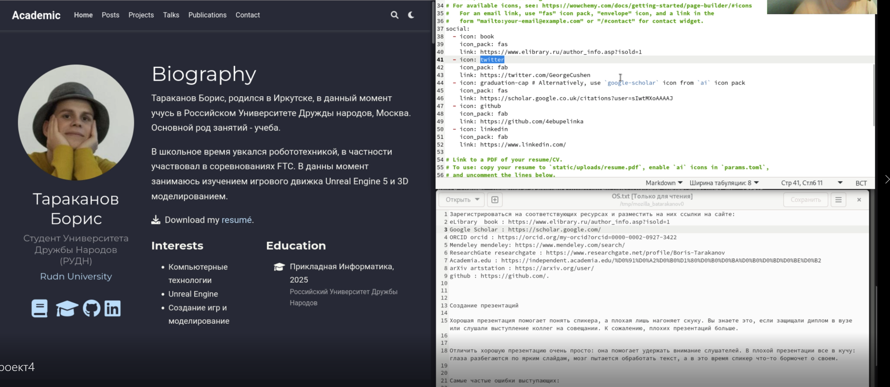
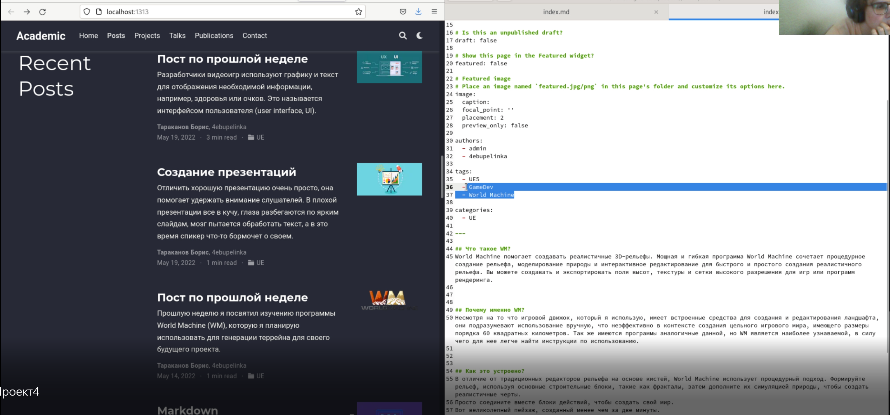
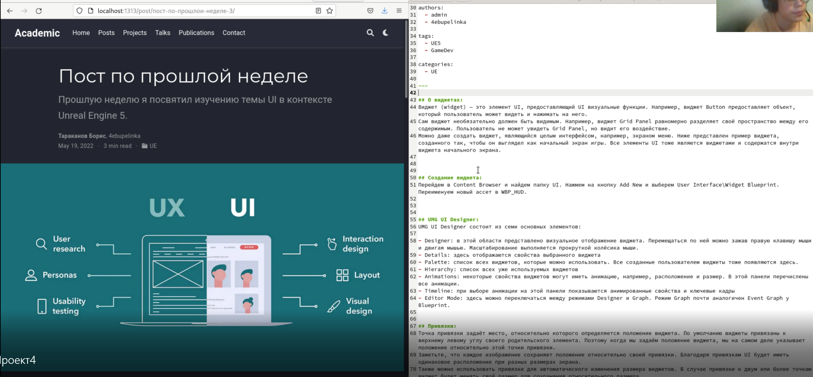

---
## Front matter
title: "Stage 4"
subtitle: "Ресурсы"
author: "Тараканов Борис, студент НПИ"

## Generic otions
lang: ru-RU
toc-title: "Содержание"

## Bibliography
bibliography: bib/cite.bib
csl: pandoc/csl/gost-r-7-0-5-2008-numeric.csl

## Pdf output format
toc: true # Table of contents
toc-depth: 2
lof: true # List of figures
lot: true # List of tables
fontsize: 12pt
linestretch: 1.5
papersize: a4
documentclass: scrreprt
## I18n polyglossia
polyglossia-lang:
  name: russian
  options:
	- spelling=modern
	- babelshorthands=true
polyglossia-otherlangs:
  name: english
## I18n babel
babel-lang: russian
babel-otherlangs: english
## Fonts
mainfont: PT Serif
romanfont: PT Serif
sansfont: PT Sans
monofont: PT Mono
mainfontoptions: Ligatures=TeX
romanfontoptions: Ligatures=TeX
sansfontoptions: Ligatures=TeX,Scale=MatchLowercase
monofontoptions: Scale=MatchLowercase,Scale=0.9
## Biblatex
biblatex: true
biblio-style: "gost-numeric"
biblatexoptions:
  - parentracker=true
  - backend=biber
  - hyperref=auto
  - language=auto
  - autolang=other*
  - citestyle=gost-numeric
## Pandoc-crossref LaTeX customization
figureTitle: "Рис."
lofTitle: "Список иллюстраций"
## Misc options
indent: true
header-includes:
  - \usepackage{indentfirst}
  - \usepackage{float} # keep figures where there are in the text
  - \floatplacement{figure}{H} # keep figures where there are in the text
---

# Цель работы

Добавить к сайту ссылки на научные и библиометрические ресурсы.

# Задание

1. Добавить к сайту ссылки на научные и библиометрические ресурсы.
- eLibrary : https://elibrary.ru/;
- Google Scholar : https://scholar.google.com/;
- ORCID : https://orcid.org/;
- Mendeley : https://www.mendeley.com/;
- ResearchGate : https://www.researchgate.net/;
- Academia.edu : https://www.academia.edu/;
- arXiv : https://arxiv.org/;
- github : https://github.com/.
2. Сделать пост по прошедшей неделе.
3. Добавить пост на тему Создание презентаций.

# Теоретическое введение

Hugo - это генератор статических сайтов, написанный на Go. Первоначально созданный Стивом Франсиа в 2013 году, Hugo значительно расширил возможности и производительность благодаря нынешнему ведущему разработчику Бьёрну Эрику Педерсену и другим участникам.

# Выполнение лабораторной работы

Добавим ссылки на научные и библиометрические ресурсы. (рис. 1)

{ #fig:001 width=70% }

Напишем пост по прошлой неделе добавив папку в дерикторию post (мой пост посвящен UI) (рис.2)

{ #fig:001 width=70% }

Напишем пост о создании презентаций добавив папку в дерикторию post (рис. 3)

{ #fig:001 width=70% }

# Выводы

В ходе этапа я еще лучше изучил программу hugo

