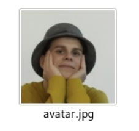
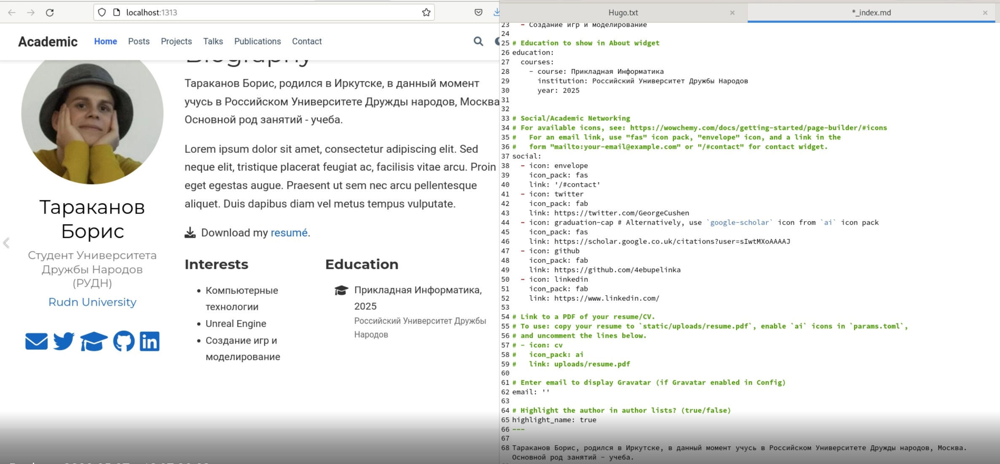
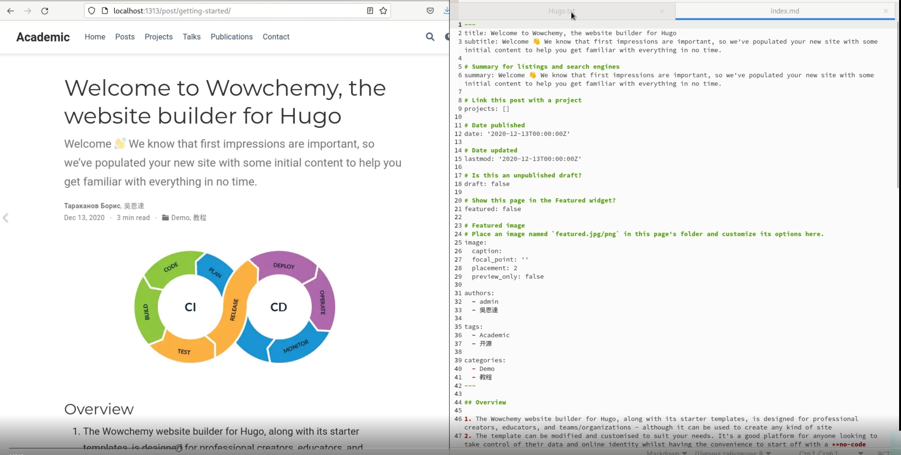
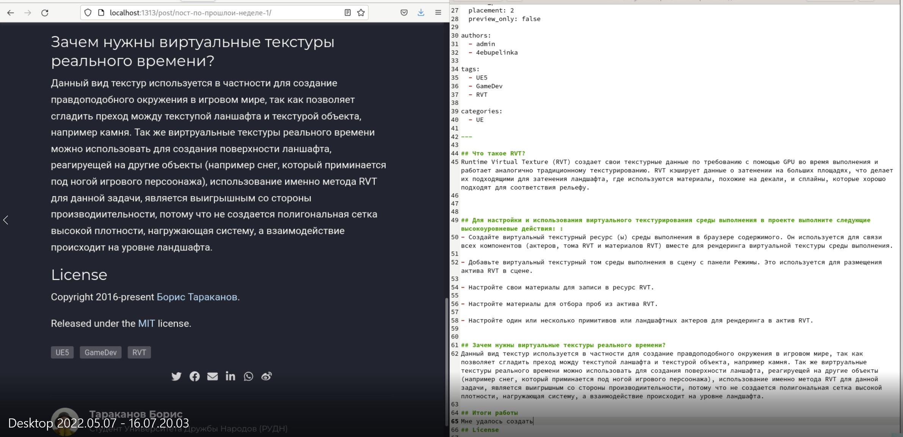

---
## Front matter
lang: ru-RU
title: Stage 2 
author: |
    Тараканов Борис - студент группы НФИбд-01-21
date: 28.04.2022

## Formatting
toc: false
slide_level: 2
theme: metropolis
header-includes: 
 - \metroset{progressbar=frametitle,sectionpage=progressbar,numbering=fraction}
 - '\makeatletter'
 - '\beamer@ignorenonframefalse'
 - '\makeatother'
aspectratio: 43
section-titles: true
---

# Индивидуальный проект, стадия 2 

## Цель работы

- Научиться работать с генератором сайтов Hugo 

## Задание 

1. Добавить свою фотографию
2. Добавить информацию о себе
3. Добавить информацию об интересах 
4. Сделать пост по прошлой неделе
5. Сделать пост на тему непрерывной интеграции и развертывания

## Выполнение лабораторной работы

## Изменение аватара

## Изменение информации о себе

## Добавим пост, посвященный непрерывной интеграции и развертыванию

{ #fig:001 width=70% }

## Добавим пост, посвященный прошлой неделе

{ #fig:001 width=70% }

## Проверка

{ #fig:001 width=70% }
{ #fig:001 width=70% }
{ #fig:001 width=70% }
{ #fig:001 width=70% }

## Вывод

В ходе выполнения лабораторной работы я познакомился с генератором статичных сайтов hugo
