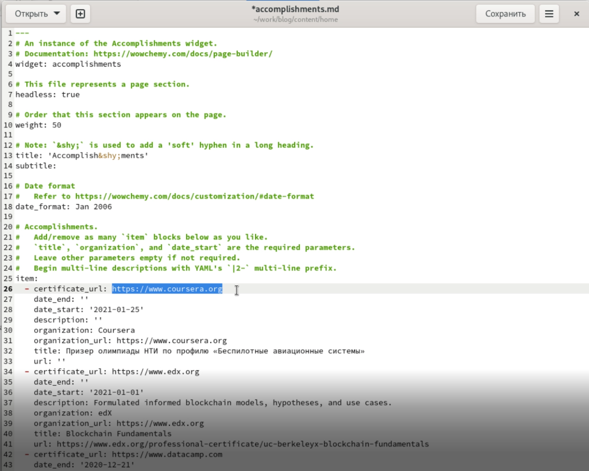
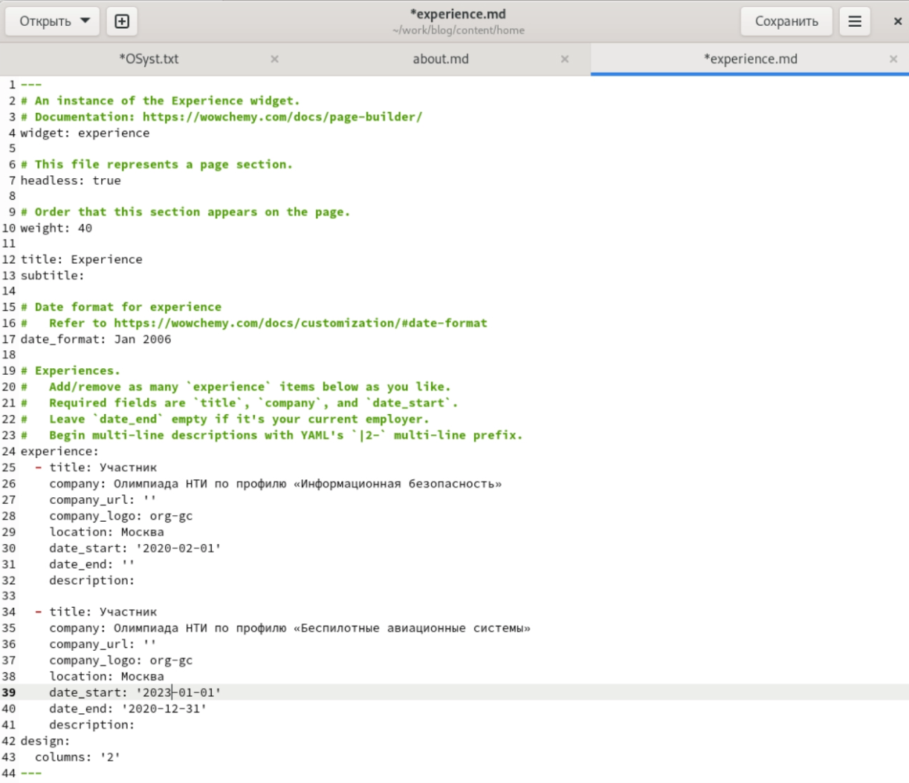
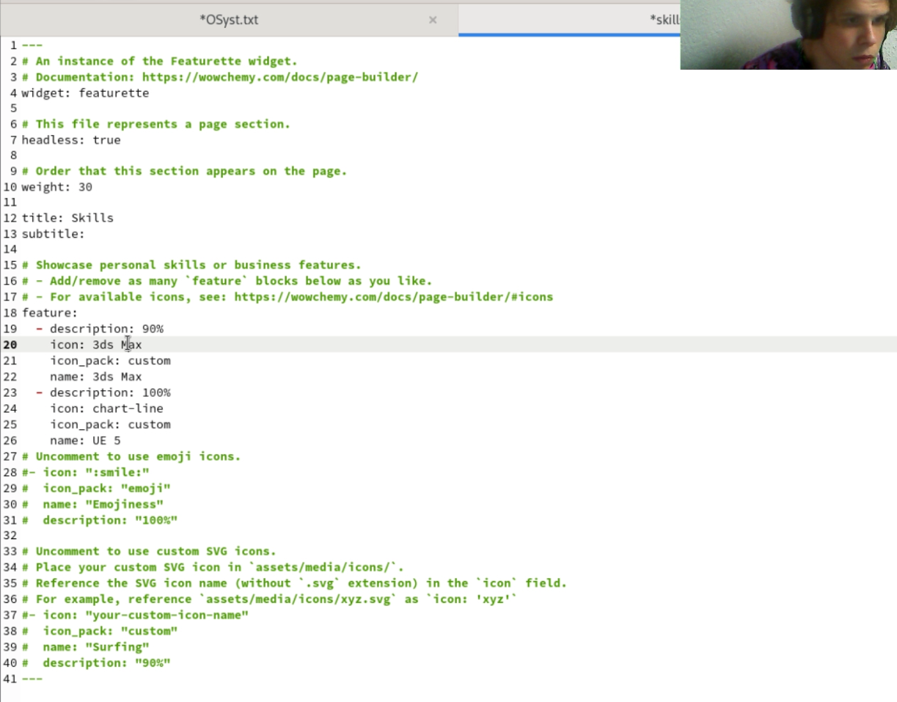
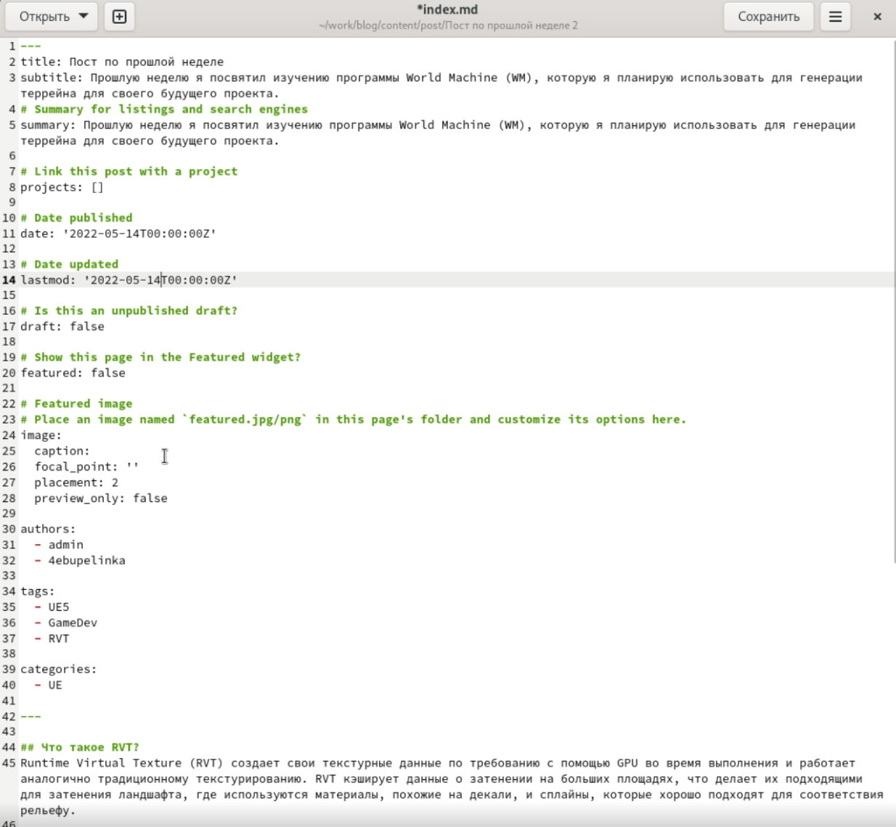
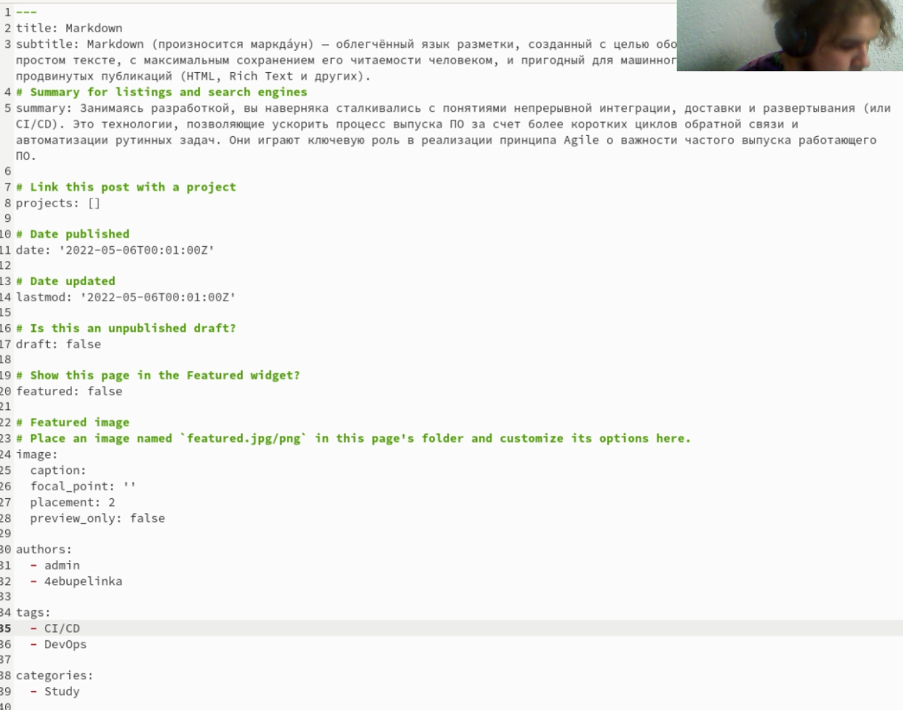

% Title
% Author1; Author2; Author3
% Date

## Цель работы

Добавить к сайту еще больше данные о себе. Добавить пост на тему: "Markdown"

## Добавить информацию о навыках (Accomplishments).

{ #fig:001 width=90% }

## Добавить информацию об опыте (Experience).

{ #fig:002 width=90% }

## Добавить информацию о достижениях (skills).

{ #fig:003 width=90% }

## Сделать пост по прошедшей неделе. (рис. 4)

{ #fig:004 width=90% }

## Добавить пост на тему: Markdown (рис. 5)

{ #fig:005 width=90% }

## Вывод

Добавили данные об опыте, достижениях и навыках. Сделали пост по прошедшей неделе. Сделали пост на тему Markdown.
